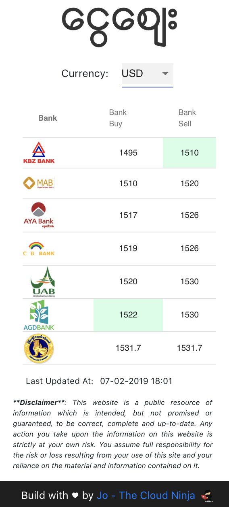
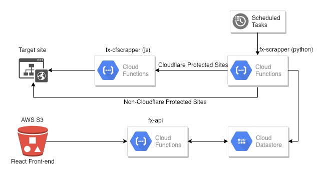

# mmk-fx-python-scrapper
Myanmar banks exchange rates web scrapper application with Python & JS on Google Cloud Platform (GCP) and AWS.

The application is currently available to view at http://mmfx.s3-website-ap-southeast-1.amazonaws.com/.



## Architecture

> Although front-end can be hosted on GCP Cloud Storage, I personally find S3 is easier to host static website.

## Content
### Live components
The following components are deployed on GCP Cloud Functions.
* `fx-api` - Written in Python; Main API function, serves request from AWS S3
* `fx-cfscrapper` - Written in JS, to bypass CloudFlare protected websites
* `fx-scrapper` - Written in Python; Scrap non CloudFlare protected websites, interact with GCP DataStore
>  Python module to bypass CloudFlare is available, however it requires Node Runtime as a pre-requisite. <br><br>
Since GCP Cloud Function can only have one runtime, a separate JS function was created to scrape CloudFlare protected sites. <br><br>
Python Package: Anorov/cloudflare-scrape - https://github.com/Anorov/cloudflare-scrape)


The following components are deployed on AWS S3
* `fx-front-end` - React Single Page Application 

### Auxiliary component
* `fx-azure-test-space` - Optionally this can be deployed on Azure Function App

## Python scrapping in a nutshell
It uses `requests` library to fetch the content of the URL. Then feed it to `BeautifulSoup` in which it allows to pull data out of HTML and XML files.

The following codeblock is the example python code block for scrapping:
```python
url = CF_SCRAPPER_CF + "?url=https://example"
r = requests.get(url)
page = r.text
soup = BeautifulSoup(page, 'lxml')
soup = soup.find('div', {"class": "exchange-box"})
rates = soup.findAll('p')[3:]
```

If it is an HTML table, consider using `Pandas` to parse the table as dataframe; it allows easier manipulation of data.

```python
exchange_rate_detail = page.find("table", {"class": "tablepress tablepress-id-1"})
table_df = pd.read_html(str(exchange_rate_detail))[0]
```
